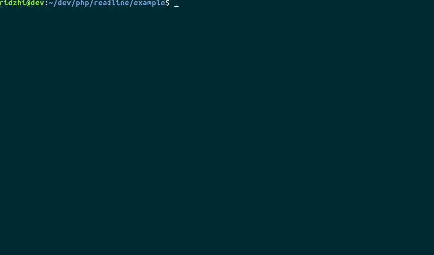

# Readline
### native readline implementation



## Installation
```
composer require ridzhi/readline
```

## Controls
### Line
* Arrow left/right - move cursor left/right
* Home - move cursor to begin
* End - move cursor to end
* Ctrl+Delete - clear line
* Page up/down - navigate by history
* Tab - complete

### Dropdown
* Arrow up/down - scroll up/down
* Enter - select
* Esc - remove focus/move to line context

## Autocomplete
For autocompletion implement `CompleteInterface`. Also you can use `Parser` helper, which return `Info` object. Info has API for writting completers practically any complexity. For more details see `example` dir.
```php
use \Ridzhi\Readline\Info\InfoInterface as IInfo;

class TestCompleter implements \Ridzhi\Readline\CompleteInterface
{

    public function complete(string $input): array
    {
        $info = \Ridzhi\Readline\Info\Parser::parse($input);

        switch ($info->getType()) {
            case IInfo::TYPE_ARG:
                // arg completion
            case IInfo::TYPE_OPTION_SHORT:
                // option completion
            case IInfo::TYPE_OPTION_LONG:
                // option completion
            case IInfo::TYPE_OPTION_VALUE:
                // option values completion
            default:
                return [];
        }

    } 

}
```
For most popular frameworks (Yii2, Symfony, Laravel) completers will be written at soon. 

## Custom handlers
Remove line from current cursor position to end. 
```php
$readline = new \Ridzhi\Readline\Readline();
//Alt+d
$readline->bind("\033d", function (\Ridzhi\Readline\Line $line) {
    $current = $line->getCurrent();
    $line->clear();
    $line->insert($current);
});
```
Close open parenthesis.
```php
$readline = new \Ridzhi\Readline\Readline();

$readline->bind("(", function (\Ridzhi\Readline\Line $line) {
    $line->insert("()");
    $line->cursorPrev();
});
```